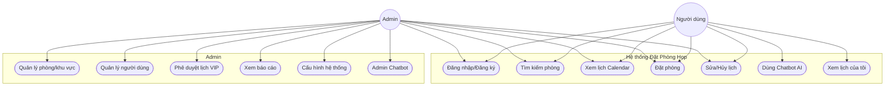
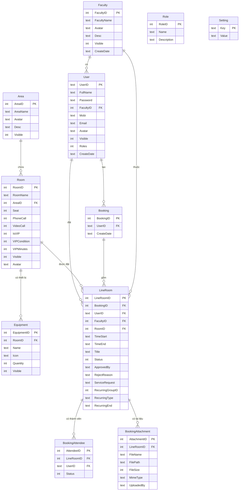
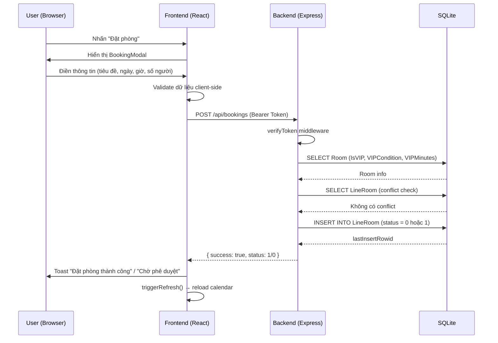
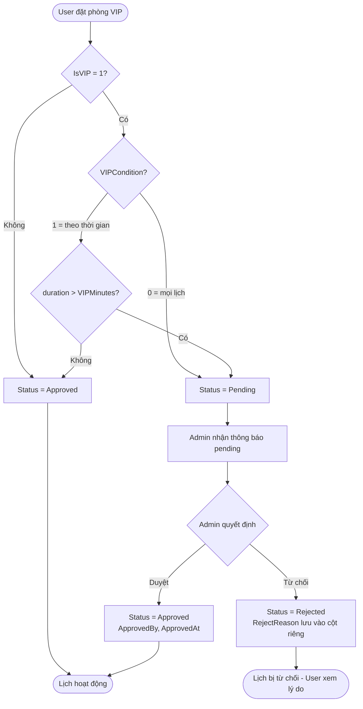
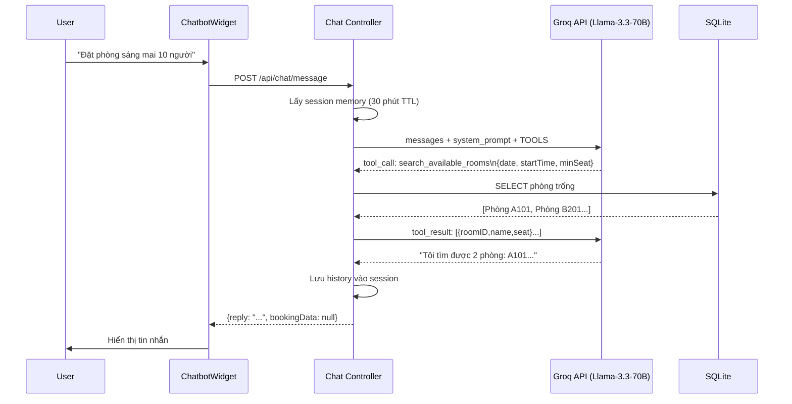

# BÁO CÁO ĐỒ ÁN TỐT NGHIỆP

---

**TRƯỜNG: [TÊN TRƯỜNG]**  
**KHOA: [TÊN KHOA]**  
**NGÀNH: CÔNG NGHỆ THÔNG TIN**

---

# WEBSITE ĐẶT PHÒNG HỌP TÍCH HỢP CHATBOT AI

---

| | |
|---|---|
| **Sinh viên thực hiện:** | [HỌ TÊN SINH VIÊN] |
| **Mã số sinh viên:** | [MSSV] |
| **Giáo viên hướng dẫn:** | [HỌ TÊN GVHD] |
| **Năm học:** | 2025 – 2026 |

---

---

# LỜI CẢM ƠN

Trong suốt quá trình thực hiện đồ án tốt nghiệp, tôi đã nhận được rất nhiều sự hỗ trợ, giúp đỡ quý báu từ thầy cô, gia đình và bạn bè.

Trước tiên, tôi xin gửi lời cảm ơn chân thành và sâu sắc nhất đến **[HỌ TÊN GVHD]** — người đã tận tình hướng dẫn, định hướng và động viên tôi trong suốt quá trình nghiên cứu và thực hiện đồ án. Những góp ý và chỉ dẫn của thầy/cô là kim chỉ nam giúp tôi hoàn thành đề tài đúng hướng và đạt chất lượng.

Tôi xin cảm ơn quý thầy cô trong **Khoa [Tên Khoa]**, Trường **[Tên Trường]** đã truyền đạt những kiến thức nền tảng quý giá trong suốt những năm học vừa qua. Nền tảng đó chính là hành trang quan trọng giúp tôi tự tin bước vào thực tiễn.

Xin cảm ơn gia đình và bạn bè đã luôn đồng hành, động viên và tạo điều kiện tốt nhất để tôi hoàn thành đồ án.

Mặc dù đã nỗ lực hết mình, song báo cáo không thể tránh khỏi những thiếu sót. Rất mong nhận được sự góp ý từ quý thầy cô để tôi hoàn thiện hơn trong tương lai.

*[Địa điểm], tháng [X] năm 2026*

**Sinh viên thực hiện**

*[HỌ TÊN SINH VIÊN]*

---

---

# MỞ ĐẦU

## 1. Lý do chọn đề tài

Trong bối cảnh chuyển đổi số đang diễn ra mạnh mẽ tại các cơ quan, trường học và doanh nghiệp, việc quản lý và đặt phòng họp theo phương thức truyền thống — liên hệ trực tiếp, ghi chép thủ công — ngày càng bộc lộ nhiều hạn chế: dễ xảy ra xung đột lịch, khó kiểm soát trạng thái phòng, tốn nhân lực quản lý và thiếu minh bạch trong quy trình phê duyệt.

Đặc biệt, sự bùng nổ của trí tuệ nhân tạo (AI) và các mô hình ngôn ngữ lớn (LLM) đã mở ra khả năng tương tác tự nhiên giữa người dùng và hệ thống thông qua ngôn ngữ nói/viết thông thường. Người dùng không cần nhớ nghiệp vụ phức tạp — chỉ cần nhắn tin "Đặt phòng họp sáng mai 10 người" là hệ thống tự động hiểu, tìm phòng và xác nhận.

Từ những lý do đó, tôi lựa chọn đề tài **"Website Đặt Phòng Họp Tích Hợp Chatbot AI"** nhằm xây dựng một hệ thống hiện đại, thân thiện và thông minh phục vụ nhu cầu quản lý phòng họp trong môi trường giáo dục và doanh nghiệp.

## 2. Mục tiêu đề tài

- Xây dựng hệ thống web đầy đủ cho phép người dùng tìm kiếm, xem lịch và đặt phòng họp trực tuyến.
- Cài đặt cơ chế phát hiện xung đột lịch theo thời gian thực.
- Tích hợp quy trình phê duyệt lịch cho phòng VIP với vai trò Admin.
- Tích hợp AI Chatbot sử dụng mô hình ngôn ngữ lớn (Llama-3.3-70B qua Groq API) với khả năng hiểu ngôn ngữ tự nhiên và thực thi hành động đặt/hủy phòng (Function Calling).
- Xây dựng giao diện admin quản lý toàn bộ hệ thống: phòng, khu vực, người dùng, thiết bị, báo cáo thống kê.

## 3. Phạm vi nghiên cứu

- **Đối tượng sử dụng:** Cán bộ, giảng viên, nhân viên trong một tổ chức/trường học.
- **Phạm vi chức năng:** Đặt phòng, xem lịch, phê duyệt, thống kê, quản lý danh mục, chatbot AI.
- **Phạm vi công nghệ:** Ứng dụng web, không bao gồm ứng dụng di động native.
- **Không bao gồm:** Tích hợp email/SMS tự động, thanh toán trực tuyến.

## 4. Phương pháp nghiên cứu

- Nghiên cứu lý thuyết: Tìm hiểu kiến trúc REST API, JWT Authentication, SQLite, React, AI Function Calling.
- Nghiên cứu thực tiễn: Khảo sát các hệ thống đặt phòng hiện có (AMIS MISA, EMS, Google Calendar).
- Phương pháp thực nghiệm: Xây dựng và kiểm thử hệ thống theo từng module.

## 5. Bố cục báo cáo

Báo cáo gồm 4 chương chính:

- **Chương 1:** Tổng quan đề tài và các công nghệ sử dụng.
- **Chương 2:** Khảo sát, so sánh các hệ thống tương tự và xác định yêu cầu.
- **Chương 3:** Phân tích và thiết kế hệ thống.
- **Chương 4:** Cài đặt chương trình và kiểm thử.

---

---

# MỤC LỤC

- [LỜI CẢM ƠN](#lời-cảm-ơn)
- [MỞ ĐẦU](#mở-đầu)
- [CHƯƠNG 1: TỔNG QUAN VÀ CÁC CÔNG NGHỆ SỬ DỤNG](#chương-1)
  - [1.1 Tổng quan về đề tài và hệ thống](#11-tổng-quan)
  - [1.2 Công nghệ phía máy chủ (Backend)](#12-backend)
  - [1.3 Công nghệ phía giao diện (Frontend)](#13-frontend)
  - [1.4 Trí tuệ nhân tạo – Groq & Llama](#14-ai)
- [CHƯƠNG 2: KHẢO SÁT VÀ SO SÁNH](#chương-2)
  - [2.1 Các hệ thống tương tự](#21)
  - [2.2 Bảng so sánh tính năng](#22)
  - [2.3 Yêu cầu người dùng](#23)
- [CHƯƠNG 3: PHÂN TÍCH THIẾT KẾ HỆ THỐNG](#chương-3)
  - [3.1 Yêu cầu chức năng](#31)
  - [3.2 Yêu cầu phi chức năng](#32)
  - [3.3 Sơ đồ Use Case](#33)
  - [3.4 Sơ đồ thực thể quan hệ (ERD)](#34)
  - [3.5 Thiết kế cơ sở dữ liệu](#35)
  - [3.6 Kiến trúc hệ thống](#36)
  - [3.7 Thiết kế API](#37)
  - [3.8 Luồng nghiệp vụ chính](#38)
  - [3.9 Kiến trúc AI Chatbot](#39)
- [CHƯƠNG 4: CÀI ĐẶT CHƯƠNG TRÌNH](#chương-4)
  - [4.1 Môi trường cài đặt](#41)
  - [4.2 Cài đặt Backend](#42)
  - [4.3 Cài đặt Frontend](#43)
  - [4.4 Tích hợp AI Chatbot](#44)
  - [4.5 Giao diện sản phẩm](#45)
  - [4.6 Kiểm thử hệ thống](#46)
- [KẾT LUẬN](#kết-luận)
- [TÀI LIỆU THAM KHẢO](#tài-liệu-tham-khảo)

---

---

# DANH MỤC HÌNH ẢNH

| STT | Hình | Trang |
|-----|------|-------|
| 1 | Hình 1.1 – Kiến trúc tổng quan hệ thống | Ch.1 |
| 2 | Hình 1.2 – Logo Node.js và Express.js | Ch.1 |
| 3 | Hình 1.3 – Logo React và Vite | Ch.1 |
| 4 | Hình 1.4 – Kiến trúc Groq Function Calling | Ch.1 |
| 5 | Hình 2.1 – Giao diện AMIS MISA Meeting Room | Ch.2 |
| 6 | Hình 2.2 – Giao diện Google Calendar | Ch.2 |
| 7 | Hình 3.1 – Sơ đồ Use Case tổng quát | Ch.3 |
| 8 | Hình 3.2 – Sơ đồ Use Case Admin | Ch.3 |
| 9 | Hình 3.3 – Sơ đồ ERD (Entity Relationship Diagram) | Ch.3 |
| 10 | Hình 3.4 – Kiến trúc Client-Server | Ch.3 |
| 11 | Hình 3.5 – Sequence Diagram: Đặt phòng | Ch.3 |
| 12 | Hình 3.6 – Sequence Diagram: Chatbot đặt phòng | Ch.3 |
| 13 | Hình 3.7 – Luồng phê duyệt lịch VIP | Ch.3 |
| 14 | Hình 4.1 – Màn hình Trang chủ (Home) | Ch.4 |
| 15 | Hình 4.2 – Màn hình Chi tiết phòng | Ch.4 |
| 16 | Hình 4.3 – Modal Đặt phòng | Ch.4 |
| 17 | Hình 4.4 – Màn hình CalendarView | Ch.4 |
| 18 | Hình 4.5 – Admin Dashboard | Ch.4 |
| 19 | Hình 4.6 – Admin Quản lý phòng | Ch.4 |
| 20 | Hình 4.7 – Admin Phê duyệt lịch VIP | Ch.4 |
| 21 | Hình 4.8 – Chatbot User (gold FAB) | Ch.4 |
| 22 | Hình 4.9 – Chatbot Admin (purple FAB) | Ch.4 |
| 23 | Hình 4.10 – Màn hình Báo cáo thống kê | Ch.4 |

---

---

# DANH MỤC BẢNG BIỂU

| STT | Bảng | Trang |
|-----|------|-------|
| 1 | Bảng 2.1 – So sánh các hệ thống đặt phòng | Ch.2 |
| 2 | Bảng 3.1 – Danh sách yêu cầu chức năng | Ch.3 |
| 3 | Bảng 3.2 – Mô tả bảng Faculty | Ch.3 |
| 4 | Bảng 3.3 – Mô tả bảng User | Ch.3 |
| 5 | Bảng 3.4 – Mô tả bảng Area | Ch.3 |
| 6 | Bảng 3.5 – Mô tả bảng Room | Ch.3 |
| 7 | Bảng 3.6 – Mô tả bảng Equipment | Ch.3 |
| 8 | Bảng 3.7 – Mô tả bảng LineRoom | Ch.3 |
| 9 | Bảng 3.8 – Mô tả bảng BookingAttendee | Ch.3 |
| 10 | Bảng 3.9 – Mô tả bảng BookingAttachment | Ch.3 |
| 11 | Bảng 3.10 – Mô tả bảng Setting | Ch.3 |
| 12 | Bảng 3.11 – Danh sách API Backend | Ch.3 |
| 13 | Bảng 4.1 – Môi trường phát triển | Ch.4 |
| 14 | Bảng 4.2 – Kết quả kiểm thử chức năng | Ch.4 |
| 15 | Bảng 4.3 – Kết quả kiểm thử chatbot | Ch.4 |

---

---

<a name="chương-1"></a>
# CHƯƠNG 1: TỔNG QUAN VÀ CÁC CÔNG NGHỆ SỬ DỤNG

<a name="11-tổng-quan"></a>
## 1.1 Tổng quan về đề tài và hệ thống

### 1.1.1 Giới thiệu bài toán

Quản lý phòng họp là một trong những bài toán quản trị phổ biến trong các tổ chức, trường học và doanh nghiệp. Khi số lượng phòng và người dùng tăng, các vấn đề thường gặp bao gồm:

- **Trùng lịch:** Nhiều người cùng đặt một phòng trong cùng khung giờ.
- **Thiếu minh bạch:** Người dùng không biết phòng nào còn trống.
- **Quy trình phê duyệt thủ công:** Admin phải xét duyệt qua email/giấy tờ.
- **Thiếu thống kê:** Không có báo cáo tổng hợp tỷ lệ sử dụng phòng.

Hệ thống **Website Đặt Phòng Họp Tích Hợp Chatbot AI** được xây dựng nhằm giải quyết toàn diện các vấn đề trên, đồng thời tích hợp AI Chatbot cho phép người dùng tương tác bằng ngôn ngữ tự nhiên để tìm phòng, đặt lịch và hủy lịch.

### 1.1.2 Kiến trúc tổng quan

Hệ thống được xây dựng theo mô hình **Client-Server** với kiến trúc **RESTful API**:

```
┌─────────────────────────────────────────────────────────┐
│                    CLIENT (Browser)                      │
│         React 18 + Vite + Zustand + FullCalendar         │
│              Port 3000 (dev) / Nginx (prod)              │
└──────────────────────┬──────────────────────────────────┘
                       │ HTTP/HTTPS (JSON REST API)
                       │ JWT Bearer Token
┌──────────────────────▼──────────────────────────────────┐
│                   SERVER (Node.js)                       │
│            Express.js + helmet + rate-limit              │
│                     Port 5000                            │
│  ┌─────────────┐  ┌──────────────┐  ┌────────────────┐  │
│  │  Auth API   │  │  Booking API │  │   Admin API    │  │
│  │  /api/auth  │  │ /api/booking │  │  /api/rooms    │  │
│  └─────────────┘  └──────────────┘  └────────────────┘  │
│  ┌─────────────────────────────────────────────────────┐ │
│  │               Chat Controller                       │ │
│  │     Groq SDK → Llama-3.3-70B (Function Calling)     │ │
│  └─────────────────────────────────────────────────────┘ │
└──────────────────────┬──────────────────────────────────┘
                       │ better-sqlite3
┌──────────────────────▼──────────────────────────────────┐
│              DATABASE (SQLite)                           │
│         meeting_booking.db (file-based)                  │
│  Faculty | User | Area | Room | Equipment               │
│  Booking | LineRoom | BookingAttendee | BookingAttachment│
│  Role | Setting                                         │
└─────────────────────────────────────────────────────────┘
                       │
┌──────────────────────▼──────────────────────────────────┐
│              EXTERNAL API                                │
│        Groq Cloud API (groq.com)                        │
│        Model: llama-3.3-70b-versatile                   │
└─────────────────────────────────────────────────────────┘
```

*Hình 1.1 – Kiến trúc tổng quan hệ thống*

### 1.1.3 Các vai trò người dùng

Hệ thống phân biệt hai vai trò chính:

| Vai trò | Mô tả | Quyền |
|---------|-------|-------|
| **User (Roles=0)** | Người dùng thông thường | Xem phòng, đặt lịch, hủy lịch của mình, dùng chatbot |
| **Admin (Roles=1)** | Quản trị viên | Toàn bộ quyền của User + quản lý phòng/khu vực/người dùng/thiết bị, duyệt lịch VIP, xem báo cáo |

---

<a name="12-backend"></a>
## 1.2 Công nghệ phía máy chủ (Backend)

### 1.2.1 Node.js

**Node.js** là môi trường runtime JavaScript phía máy chủ, được xây dựng trên engine V8 của Google Chrome. Đặc điểm nổi bật:

- **Kiến trúc non-blocking I/O:** Xử lý nhiều kết nối đồng thời mà không cần đa luồng, phù hợp với ứng dụng có nhiều thao tác I/O như đọc/ghi cơ sở dữ liệu và gọi API ngoài.
- **Hệ sinh thái npm phong phú:** Hơn 2 triệu package, cung cấp giải pháp cho hầu hết mọi nhu cầu.
- **JavaScript end-to-end:** Dùng chung ngôn ngữ với frontend, giảm chi phí chuyển đổi ngữ cảnh.

Dự án sử dụng **Node.js v18+** với entry point tại `backend/server.js`.

### 1.2.2 Express.js

**Express.js** là framework web tối giản và linh hoạt cho Node.js, cung cấp:

- Hệ thống **routing** theo phương thức HTTP (GET, POST, PUT, DELETE).
- **Middleware pipeline:** Xử lý request theo chuỗi (CORS → Auth → Rate Limit → Controller).
- Dễ tích hợp với các module bảo mật như `helmet`, `express-rate-limit`.

Cấu trúc middleware trong `backend/src/app.js`:

```javascript
app.use(helmet());                    // Bảo mật HTTP headers
app.use(cors(corsOptions));           // Cho phép cross-origin từ frontend
app.use(express.json({ limit: '10mb' }));
app.use('/api/auth',    authRoutes);
app.use('/api/rooms',   roomRoutes);
app.use('/api/bookings', bookingRoutes);
app.use('/api/chat',    chatRoutes);
// ... các route khác
```

### 1.2.3 SQLite với better-sqlite3

**SQLite** là hệ quản trị cơ sở dữ liệu quan hệ dạng file, không cần cài đặt server riêng. Lựa chọn SQLite phù hợp với đồ án vì:

- **Đơn giản triển khai:** Toàn bộ dữ liệu lưu trong một file `.db`.
- **Hiệu năng tốt** với quy mô vừa và nhỏ (dưới vài triệu bản ghi).
- **better-sqlite3** cung cấp API đồng bộ (synchronous), đơn giản hơn async/await, phù hợp với Express.

Module `backend/src/config/db.js` bọc các thao tác truy vấn và tự động chuyển đổi cú pháp:

```javascript
// Wrapper tự convert MSSQL syntax → SQLite syntax
// @param → :param
// [Table] → "Table"
// GETDATE() → datetime('now','localtime')
```

### 1.2.4 JWT Authentication

Hệ thống dùng **JSON Web Token (JWT)** cho xác thực:

- **Access Token:** Hiệu lực 15 phút, gửi qua `Authorization: Bearer <token>`.
- **Refresh Token:** Hiệu lực 7 ngày, lưu trong **HttpOnly Cookie** (bảo vệ khỏi XSS).
- Luồng refresh tự động phía frontend qua Axios interceptor.

```
Client                    Server
  │──── POST /auth/login ──►│
  │◄─── accessToken (15m) ──│  (body JSON)
  │◄─── refreshToken (7d) ──│  (HttpOnly Cookie)
  │                          │
  │─── GET /api/rooms ──────►│  Authorization: Bearer <accessToken>
  │◄──────────────── data ───│
  │                          │
  │ (accessToken hết hạn)    │
  │─── POST /auth/refresh ──►│  Cookie: refreshToken
  │◄─── new accessToken ─────│
```

### 1.2.5 Các module bảo mật khác

| Module | Chức năng |
|--------|-----------|
| `helmet` | Thiết lập HTTP security headers (XSS, clickjacking...) |
| `express-rate-limit` | Giới hạn số request/phút để chống brute-force |
| `bcryptjs` | Hash mật khẩu với salt rounds = 10 |
| `multer` | Upload file ảnh (JPG/PNG, ≤5MB) và tài liệu (PDF/Word/Excel, ≤20MB) |

---

<a name="13-frontend"></a>
## 1.3 Công nghệ phía giao diện (Frontend)

### 1.3.1 React 18

**React** là thư viện JavaScript phổ biến nhất để xây dựng giao diện người dùng, do Meta phát triển. Phiên bản 18 giới thiệu:

- **Concurrent Rendering:** Render không chặn luồng chính.
- **Automatic Batching:** Gộp nhiều state update thành một lần render.
- **Hooks API** (`useState`, `useEffect`, `useCallback`, `useMemo`) thay thế hoàn toàn class component.

### 1.3.2 Vite

**Vite** là build tool thế hệ mới, cung cấp:

- **Dev server cực nhanh** với ES modules native, không cần bundle lại toàn bộ khi sửa file.
- **Hot Module Replacement (HMR):** Cập nhật giao diện tức thì khi lưu file.
- Build production tối ưu với Rollup.

Dự án chạy frontend tại port `3000` bằng lệnh `npm run dev`.

### 1.3.3 Zustand

**Zustand** là thư viện quản lý state nhẹ (3KB) cho React, đơn giản hơn Redux nhưng đủ mạnh cho ứng dụng vừa. Dự án có 3 store:

| Store | Nội dung |
|-------|----------|
| `authStore` | `user`, `accessToken`, `setAuth()`, `logout()`, `isAdmin()` |
| `uiStore` | Trạng thái modal (`showLogin`, `showBooking`...), `refreshKey`, `triggerRefresh()` |
| `settingsStore` | Cài đặt hệ thống (`slotDuration()`, `hour12()`), fetch từ `/api/settings` |

`authStore` và `uiStore` được persist xuống `localStorage` để giữ session khi reload trang.

### 1.3.4 FullCalendar

**FullCalendar** là thư viện lịch tương tác mạnh mẽ, hỗ trợ:

- Chế độ xem: Month, Week, Day, TimeGrid.
- Hiển thị sự kiện với màu sắc tùy chỉnh theo trạng thái (Pending/Approved/Rejected/Cancelled).
- `slotDuration` cấu hình từ `settingsStore` (5/10/15/30 phút).

### 1.3.5 Axios và các thư viện hỗ trợ

| Thư viện | Vai trò |
|----------|---------|
| **Axios** | HTTP client, auto-refresh JWT token qua interceptor |
| **react-hot-toast** | Hiển thị thông báo toast (thành công/lỗi) |
| **dayjs** | Xử lý ngày giờ nhẹ hơn moment.js |
| **Font Awesome (CDN)** | Icon library |

---

<a name="14-ai"></a>
## 1.4 Trí tuệ nhân tạo – Groq & Llama-3.3-70B

### 1.4.1 Groq và GroqCloud

**Groq** là công ty phát triển chip AI chuyên dụng (LPU – Language Processing Unit) với tốc độ inference vượt trội. **GroqCloud** cung cấp API tương thích OpenAI, cho phép gọi các mô hình LLM lớn với độ trễ thấp và có tầng miễn phí.

### 1.4.2 Llama-3.3-70B-Versatile

**Meta Llama 3.3 70B Versatile** là mô hình ngôn ngữ lớn mã nguồn mở của Meta AI với:

- **70 tỷ tham số**, hiệu năng cạnh tranh với các mô hình thương mại.
- Hỗ trợ **Function Calling** (Tool Use): Mô hình có thể quyết định gọi hàm với tham số cụ thể.
- Hỗ trợ đa ngôn ngữ bao gồm tiếng Việt.
- Ngữ cảnh 128K token.

### 1.4.3 Function Calling (Tool Use)

**Function Calling** là kỹ thuật cho phép LLM không chỉ trả lời văn bản mà còn kết nối với hàm thực thi bên ngoài. Luồng hoạt động:

```
User: "Đặt phòng họp sáng mai 10 người"
        │
        ▼
[Groq API / Llama-3.3-70B]
  Phân tích ý định → Quyết định gọi tool
        │
        ▼
Tool Call: search_available_rooms
  { date: "2026-05-26", startTime: "08:00",
    minSeat: 10, durationMinutes: 60 }
        │
        ▼
[Backend thực thi hàm → truy vấn SQLite]
  → Trả về danh sách phòng trống
        │
        ▼
[Groq tiếp tục xử lý kết quả tool]
  → Tổng hợp → Phản hồi tiếng Việt tự nhiên
        │
        ▼
"Tôi tìm được 3 phòng trống sáng mai: 
 Phòng A101 (20 chỗ, Khu A)..."
```

*Hình 1.4 – Luồng Groq Function Calling*

### 1.4.4 Server-side Session Memory

Lịch sử hội thoại được lưu tại **server** (không phụ thuộc client) trong `Map<userID, session>`:

- TTL: 30 phút không hoạt động.
- Tối đa 40 messages/session (rolling window).
- Cleanup tự động mỗi 10 phút.

Điều này đảm bảo chatbot "nhớ" ngữ cảnh cuộc trò chuyện xuyên suốt nhiều tin nhắn.

---

---

<a name="chương-2"></a>
# CHƯƠNG 2: KHẢO SÁT VÀ SO SÁNH

<a name="21"></a>
## 2.1 Các hệ thống tương tự

### 2.1.1 AMIS MISA – Module Đặt phòng họp

**AMIS MISA** là phần mềm quản trị doanh nghiệp của công ty MISA, trong đó có module quản lý phòng họp tích hợp với hệ sinh thái AMIS. Tính năng nổi bật:

- Xem lịch phòng họp trực quan theo ngày/tuần.
- Đặt phòng online có thông báo cho người tham dự.
- Tích hợp sâu với AMIS HR, AMIS Công việc.
- **Hạn chế:** Chi phí cao (thuê bao doanh nghiệp), không tùy biến được, không có chatbot AI.

### 2.1.2 Google Calendar + Google Meet

**Google Calendar** được nhiều tổ chức dùng để quản lý lịch họp:

- Tạo sự kiện với phòng họp (Room Resource).
- Tích hợp Google Meet cho họp trực tuyến.
- **Hạn chế:** Không chuyên biệt cho đặt phòng vật lý, không có quy trình phê duyệt VIP, không chatbot.

### 2.1.3 EMS (Event Management System)

Một số trường đại học dùng EMS để quản lý phòng:

- Quản lý nhiều loại không gian (phòng họp, hội trường, lớp học).
- Quy trình phê duyệt đa cấp.
- **Hạn chế:** Giao diện cũ, không có tích hợp AI, phức tạp cho người dùng thông thường.

### 2.1.4 Hệ thống tự xây dựng (In-house)

Nhiều tổ chức tự xây hệ thống đặt phòng bằng Excel/Google Sheets hoặc ứng dụng nội bộ đơn giản:

- **Ưu điểm:** Đáp ứng đúng yêu cầu đặc thù.
- **Hạn chế:** Thiếu conflict detection, không có UI calendar, không có AI.

---

<a name="22"></a>
## 2.2 Bảng so sánh tính năng

**Bảng 2.1 – So sánh các hệ thống đặt phòng họp**

| Tính năng | Hệ thống đề tài | AMIS MISA | Google Calendar | EMS |
|-----------|:-:|:-:|:-:|:-:|
| Xem lịch phòng (calendar) | ✅ | ✅ | ✅ | ✅ |
| Conflict detection tự động | ✅ | ✅ | ✅ | ✅ |
| Phê duyệt lịch VIP | ✅ | ✅ | ❌ | ✅ |
| Quản lý thiết bị phòng | ✅ | ✅ | ❌ | ✅ |
| Đặt lịch định kỳ | ✅ | ✅ | ✅ | ✅ |
| Upload tài liệu đính kèm | ✅ | ✅ | ✅ | ❌ |
| AI Chatbot ngôn ngữ tự nhiên | ✅ | ❌ | ❌ | ❌ |
| Chatbot đặt/hủy phòng qua chat | ✅ | ❌ | ❌ | ❌ |
| Báo cáo thống kê | ✅ | ✅ | ❌ | ✅ |
| Miễn phí / Mã nguồn mở | ✅ | ❌ | Giới hạn | ❌ |
| Tùy biến theo yêu cầu | ✅ | ❌ | ❌ | Giới hạn |

*Ghi chú: ✅ Có | ❌ Không có*

Qua bảng so sánh, hệ thống đề tài nổi bật ở điểm tích hợp **AI Chatbot Function Calling** — tính năng chưa có ở các hệ thống tương tự đang khảo sát.

---

<a name="23"></a>
## 2.3 Yêu cầu người dùng

Qua khảo sát thực tế nhu cầu quản lý phòng họp trong môi trường giáo dục, các yêu cầu chính được xác định:

### Người dùng thông thường cần:
1. Tìm kiếm phòng trống nhanh theo tiêu chí (số người, thời gian, khu vực).
2. Xem lịch trực quan, biết ngay phòng nào còn trống.
3. Đặt phòng đơn giản, không qua nhiều bước.
4. Đặt lịch lặp lại (họp hàng tuần).
5. Mời người tham dự.
6. Hủy lịch dễ dàng.
7. **Đặt phòng qua chat AI** bằng ngôn ngữ tự nhiên tiếng Việt.

### Admin cần:
1. Quản lý danh mục: phòng, khu vực, thiết bị, người dùng.
2. Phê duyệt hoặc từ chối lịch đặt phòng VIP (có lý do).
3. Xem báo cáo thống kê sử dụng phòng theo tuần/tháng.
4. Cấu hình hệ thống (múi giờ, định dạng giờ, slot time).
5. **Quản lý qua chatbot AI** (xem lịch pending, duyệt nhanh).

---

---

<a name="chương-3"></a>
# CHƯƠNG 3: PHÂN TÍCH THIẾT KẾ HỆ THỐNG

<a name="31"></a>
## 3.1 Yêu cầu chức năng

**Bảng 3.1 – Danh sách yêu cầu chức năng**

| Mã | Chức năng | Vai trò | Ưu tiên |
|----|-----------|---------|---------|
| F01 | Đăng nhập / Đăng xuất | Tất cả | P0 |
| F02 | Đăng ký tài khoản mới | User | P0 |
| F03 | Đổi mật khẩu | Tất cả | P0 |
| F04 | Xem danh sách phòng họp | Tất cả | P0 |
| F05 | Tìm kiếm phòng (tên, khu vực) | Tất cả | P0 |
| F06 | Xem chi tiết phòng (thiết bị, lịch) | Tất cả | P0 |
| F07 | Xem lịch đặt phòng (calendar) | Tất cả | P0 |
| F08 | Đặt phòng (conflict detection) | User/Admin | P0 |
| F09 | Đặt lịch lặp lại (recurring) | User/Admin | P1 |
| F10 | Sửa lịch đặt phòng | User/Admin | P0 |
| F11 | Hủy lịch đặt phòng | User/Admin | P0 |
| F12 | Mời người tham dự | User/Admin | P1 |
| F13 | Thêm yêu cầu dịch vụ | User/Admin | P1 |
| F14 | Upload tài liệu đính kèm | User/Admin | P1 |
| F15 | Admin: CRUD phòng họp | Admin | P0 |
| F16 | Admin: CRUD khu vực | Admin | P0 |
| F17 | Admin: CRUD người dùng | Admin | P0 |
| F18 | Admin: CRUD thiết bị phòng | Admin | P1 |
| F19 | Admin: Phê duyệt lịch VIP | Admin | P0 |
| F20 | Admin: Từ chối lịch (có lý do) | Admin | P0 |
| F21 | Admin: Xem báo cáo thống kê | Admin | P1 |
| F22 | Admin: Cấu hình hệ thống | Admin | P1 |
| F23 | Chatbot: Tìm phòng qua chat | User/Admin | P1 |
| F24 | Chatbot: Đặt phòng qua chat | User/Admin | P1 |
| F25 | Chatbot: Xem lịch qua chat | User/Admin | P1 |
| F26 | Chatbot: Hủy lịch qua chat | User/Admin | P1 |
| F27 | Admin Chatbot: Duyệt lịch qua chat | Admin | P2 |

---

<a name="32"></a>
## 3.2 Yêu cầu phi chức năng

| Loại | Yêu cầu |
|------|---------|
| **Hiệu năng** | API phản hồi < 500ms với truy vấn thông thường |
| **Bảo mật** | HTTPS, JWT, HttpOnly cookie, bcrypt, helmet, rate-limit |
| **Tính sẵn sàng** | Hệ thống hoạt động 24/7, restart tự động khi crash |
| **Tương thích** | Chrome, Firefox, Edge (phiên bản mới nhất) |
| **Khả năng mở rộng** | Có thể nâng cấp từ SQLite → PostgreSQL khi cần |
| **Dễ sử dụng** | Giao diện trực quan, tối đa 3 bước để đặt phòng |
| **Responsive** | Hiển thị đúng trên desktop và tablet |

---

<a name="33"></a>
## 3.3 Sơ đồ Use Case

### 3.3.1 Use Case tổng quát



*Hình 3.1 – Sơ đồ Use Case tổng quát*

### 3.3.2 Mô tả Use Case: Đặt phòng họp (UC04)

| Thuộc tính | Nội dung |
|-----------|---------|
| **Tên UC** | Đặt phòng họp |
| **Mã UC** | UC04 |
| **Tác nhân** | User, Admin |
| **Điều kiện tiên quyết** | Người dùng đã đăng nhập |
| **Luồng chính** | 1. Người dùng vào trang chi tiết phòng hoặc calendar; 2. Nhấn "Đặt phòng"; 3. Điền thông tin (tiêu đề, ngày, giờ bắt đầu, giờ kết thúc, số người, ghi chú); 4. Nhấn "Xác nhận"; 5. Hệ thống kiểm tra conflict; 6. Nếu phòng thường → Approved tự động; Nếu phòng VIP → Pending (chờ admin duyệt); 7. Hiển thị thông báo thành công. |
| **Luồng thay thế** | Nếu có conflict → Hiển thị lỗi "Phòng đã được đặt trong khung giờ này" |
| **Hậu điều kiện** | Bản ghi LineRoom được tạo với Status phù hợp |

### 3.3.3 Mô tả Use Case: Phê duyệt lịch VIP (UC10)

| Thuộc tính | Nội dung |
|-----------|---------|
| **Tên UC** | Phê duyệt lịch đặt phòng VIP |
| **Mã UC** | UC10 |
| **Tác nhân** | Admin |
| **Điều kiện tiên quyết** | Admin đã đăng nhập; Có lịch đặt với Status=Pending |
| **Luồng chính** | 1. Admin vào `/admin/approvals`; 2. Xem danh sách lịch đang chờ duyệt; 3. Nhấn "Duyệt" hoặc "Từ chối"; 4. Nếu từ chối: nhập lý do; 5. Xác nhận. |
| **Hậu điều kiện** | LineRoom.Status = Approved(1) hoặc Rejected(2); Nếu từ chối: LineRoom.RejectReason được lưu |

---

<a name="34"></a>
## 3.4 Sơ đồ thực thể quan hệ (ERD)



*Hình 3.3 – Sơ đồ ERD*

---

<a name="35"></a>
## 3.5 Thiết kế cơ sở dữ liệu

### Bảng Faculty (Khoa/Đơn vị)

**Bảng 3.2 – Mô tả bảng Faculty**

| Cột | Kiểu | Ràng buộc | Mô tả |
|-----|------|-----------|-------|
| FacultyID | INTEGER | PK, AUTOINCREMENT | Mã khoa |
| FacultyName | TEXT | NOT NULL | Tên khoa/đơn vị |
| Avatar | TEXT | DEFAULT '' | Đường dẫn ảnh đại diện |
| Desc | TEXT | DEFAULT '' | Mô tả |
| Visible | INTEGER | DEFAULT 1 | 1=hiển thị, 0=ẩn |
| CreateDate | TEXT | DEFAULT datetime() | Ngày tạo |
| CreateBy | TEXT | DEFAULT 'admin' | Người tạo |

### Bảng User (Người dùng)

**Bảng 3.3 – Mô tả bảng User**

| Cột | Kiểu | Ràng buộc | Mô tả |
|-----|------|-----------|-------|
| UserID | TEXT | PK | Tên đăng nhập (không đổi được) |
| FullName | TEXT | NOT NULL | Họ tên đầy đủ |
| Password | TEXT | NOT NULL | Mật khẩu đã bcrypt hash |
| FacultyID | INTEGER | FK → Faculty | Thuộc khoa nào |
| Mobi | TEXT | DEFAULT '' | Số điện thoại |
| Email | TEXT | DEFAULT '' | Email |
| Avatar | TEXT | DEFAULT '/uploads/images/nopic.png' | Ảnh đại diện |
| Visible | INTEGER | DEFAULT 1 | Tài khoản hoạt động |
| Roles | INTEGER | DEFAULT 0 | 0=User, 1=Admin |

### Bảng Room (Phòng họp)

**Bảng 3.5 – Mô tả bảng Room**

| Cột | Kiểu | Ràng buộc | Mô tả |
|-----|------|-----------|-------|
| RoomID | INTEGER | PK, AUTOINCREMENT | Mã phòng |
| RoomName | TEXT | NOT NULL | Tên phòng |
| AreaID | INTEGER | FK → Area | Thuộc khu vực nào |
| Seat | INTEGER | DEFAULT 10 | Số chỗ ngồi tối đa |
| PhoneCall | INTEGER | DEFAULT 0 | Có điện thoại hội nghị không |
| VideoCall | INTEGER | DEFAULT 0 | Có hệ thống video call không |
| IsVIP | INTEGER | DEFAULT 0 | Phòng VIP yêu cầu phê duyệt |
| VIPCondition | INTEGER | DEFAULT 0 | 0=mọi lịch đều cần duyệt; 1=chỉ > VIPMinutes |
| VIPMinutes | INTEGER | DEFAULT 60 | Ngưỡng thời gian để áp dụng VIP |
| Visible | INTEGER | DEFAULT 1 | 1=hiển thị |
| Avatar | TEXT | | Ảnh phòng |

### Bảng LineRoom (Lịch đặt phòng — bảng trung tâm)

**Bảng 3.7 – Mô tả bảng LineRoom**

| Cột | Kiểu | Mô tả |
|-----|------|-------|
| LineRoomID | INTEGER PK | Mã lịch đặt |
| BookingID | INTEGER FK | Thuộc booking header |
| UserID | TEXT FK | Người đặt |
| FacultyID | INTEGER FK | Khoa của người đặt |
| RoomID | INTEGER FK | Phòng được đặt |
| TimeStart | TEXT | Thời gian bắt đầu (YYYY-MM-DD HH:mm:ss) |
| TimeEnd | TEXT | Thời gian kết thúc |
| Title | TEXT | Tiêu đề cuộc họp |
| Content | TEXT | Nội dung chi tiết |
| Note | TEXT | Ghi chú thêm |
| NumberPerson | INTEGER | Số người tham dự |
| **Status** | INTEGER | **0=Pending, 1=Approved, 2=Rejected, 3=Cancelled** |
| ApprovedBy | TEXT | UserID người duyệt |
| ApprovedAt | TEXT | Thời điểm duyệt |
| **RejectReason** | TEXT | Lý do từ chối (KHÔNG ghi đè Note) |
| ServiceRequest | TEXT | Yêu cầu dịch vụ kèm theo |
| RecurringGroupID | INTEGER | ID nhóm lặp lịch |
| RecurringType | TEXT | daily / weekly / monthly |
| RecurringEnd | TEXT | Ngày kết thúc lặp lịch |

### Bảng Setting (Cài đặt hệ thống)

**Bảng 3.10 – Mô tả bảng Setting**

| Key | Giá trị mặc định | Mô tả |
|-----|---------|-------|
| `timeFormat` | `24h` | Định dạng giờ: `24h` hoặc `AM/PM` |
| `slotMinutes` | `15` | Đơn vị slot trên calendar: 5/10/15/30 phút |
| `defaultDuration` | `60` | Thời lượng mặc định khi đặt phòng (phút) |
| `maxDuration` | `480` | Thời lượng tối đa cho 1 lịch (phút) |
| `timezone` | `Asia/Ho_Chi_Minh` | Múi giờ hệ thống |
| `theme` | `light` | Giao diện: `light` hoặc `dark` |
| `workdayStart` | `07:00` | Giờ bắt đầu ngày làm việc |
| `workdayEnd` | `21:00` | Giờ kết thúc ngày làm việc |

---

<a name="36"></a>
## 3.6 Kiến trúc hệ thống

### 3.6.1 Cấu trúc thư mục Backend

```
backend/
├── server.js                 ← Entry point
└── src/
    ├── app.js                ← Express setup, mount routes
    ├── config/
    │   ├── db.js             ← SQLite wrapper (query/queryOne/execute)
    │   ├── init-db.js        ← Tạo schema + seed data
    │   └── migrate.js        ← Migration an toàn
    ├── controllers/          ← Business logic
    │   ├── auth.controller.js
    │   ├── booking.controller.js
    │   ├── lineroom.controller.js
    │   ├── room.controller.js
    │   ├── chat.controller.js
    │   └── ...
    ├── routes/               ← Route definitions
    ├── middleware/
    │   ├── auth.js           ← verifyToken (JWT Bearer)
    │   ├── adminOnly.js      ← Chặn non-admin
    │   ├── upload.js         ← Multer ảnh (5MB)
    │   └── uploadDocs.js     ← Multer tài liệu (20MB)
    └── utils/
        ├── response.js       ← success/error/notFound/badRequest/forbidden
        └── hashPassword.js
```

### 3.6.2 Cấu trúc thư mục Frontend

```
frontend/src/
├── App.jsx                   ← Root: ẩn Navbar/ChatbotWidget khi /admin/*
├── router/AppRouter.jsx      ← React Router v6 + AdminRoute guard
├── pages/
│   ├── Home.jsx              ← Trang chủ: tìm kiếm + room grid
│   ├── BookDetail.jsx        ← Chi tiết phòng + calendar + thiết bị
│   ├── CalendarView.jsx      ← Calendar 3 chế độ
│   ├── Report.jsx            ← Báo cáo chart
│   └── admin/
│       ├── Dashboard.jsx     ← Stat cards + chart + pending
│       ├── Approvals.jsx     ← Duyệt lịch VIP
│       ├── Rooms.jsx, Areas.jsx, Users.jsx, Equipment.jsx
│       ├── Settings.jsx, Roles.jsx, Faculties.jsx
├── components/
│   ├── Navbar.jsx
│   ├── AdminLayout.jsx       ← Sidebar layout
│   ├── calendar/BookingCalendar.jsx
│   ├── chat/
│   │   ├── ChatbotWidget.jsx      ← User chatbot (gold FAB)
│   │   └── AdminChatbotWidget.jsx ← Admin chatbot (purple FAB)
│   └── modals/               ← LoginModal, BookingModal, BookingDetailModal...
├── services/
│   ├── api.js                ← Axios instance + auto-refresh interceptor
│   └── index.js              ← Tất cả service functions
└── store/
    ├── authStore.js
    ├── uiStore.js
    └── settingsStore.js
```

---

<a name="37"></a>
## 3.7 Thiết kế API

**Bảng 3.11 – Danh sách API Backend**

### Authentication

| Method | Endpoint | Auth | Mô tả |
|--------|----------|------|-------|
| POST | `/api/auth/login` | ❌ | Đăng nhập, trả về accessToken + set refreshToken cookie |
| POST | `/api/auth/register` | ❌ | Đăng ký tài khoản mới |
| POST | `/api/auth/logout` | ✅ | Đăng xuất, xóa cookie |
| POST | `/api/auth/refresh` | Cookie | Làm mới accessToken |
| GET | `/api/auth/me` | ✅ | Lấy thông tin người dùng hiện tại |

### Rooms

| Method | Endpoint | Auth | Mô tả |
|--------|----------|------|-------|
| GET | `/api/rooms` | ❌ | Danh sách phòng (có filter tên, khu vực) |
| GET | `/api/rooms/:id` | ❌ | Chi tiết một phòng |
| POST | `/api/rooms` | Admin | Tạo phòng mới |
| PUT | `/api/rooms/:id` | Admin | Cập nhật phòng |
| DELETE | `/api/rooms/:id` | Admin | Xóa phòng |

### Bookings

| Method | Endpoint | Auth | Mô tả |
|--------|----------|------|-------|
| POST | `/api/bookings` | ✅ | Đặt phòng (kèm conflict check, VIP logic) |
| PUT | `/api/bookings/:id` | ✅ | Sửa lịch đặt |
| PUT | `/api/bookings/:id/approve` | Admin | Phê duyệt lịch |
| PUT | `/api/bookings/:id/reject` | Admin | Từ chối lịch (kèm reason) |
| PUT | `/api/bookings/:id/cancel` | ✅ | Hủy lịch |
| GET | `/api/bookings/pending` | Admin | Danh sách lịch chờ duyệt |

### LineRooms

| Method | Endpoint | Auth | Mô tả |
|--------|----------|------|-------|
| GET | `/api/linerooms/all` | Admin | Tất cả lịch đặt |
| GET | `/api/linerooms/my` | ✅ | Lịch đặt của tôi |
| GET | `/api/linerooms/room/:roomID` | ✅ | Lịch theo phòng |
| GET | `/api/linerooms/area/:areaID` | ✅ | Lịch theo khu vực |
| GET | `/api/linerooms/:id` | ✅ | Chi tiết lịch đặt |
| DELETE | `/api/linerooms/:id` | ✅ | Xóa lịch |
| POST | `/api/linerooms/:id/attendees` | ✅ | Thêm người tham dự |

### Chat (AI Chatbot)

| Method | Endpoint | Auth | Mô tả |
|--------|----------|------|-------|
| POST | `/api/chat/message` | ✅ | Gửi tin nhắn, nhận phản hồi AI |
| GET | `/api/chat/history` | ✅ | Lịch sử hội thoại |
| DELETE | `/api/chat/session` | ✅ | Xóa session hiện tại |

### Settings

| Method | Endpoint | Auth | Mô tả |
|--------|----------|------|-------|
| GET | `/api/settings` | ❌ | Lấy cài đặt hệ thống (public) |
| PUT | `/api/settings` | Admin | Cập nhật cài đặt |

### Reports

| Method | Endpoint | Auth | Mô tả |
|--------|----------|------|-------|
| GET | `/api/report/chart` | Admin | Dữ liệu biểu đồ theo tuần/tháng |
| GET | `/api/report/summary` | Admin | Tổng hợp số liệu |
| GET | `/api/report/roomUsage` | Admin | Tỷ lệ sử dụng từng phòng |

---

<a name="38"></a>
## 3.8 Luồng nghiệp vụ chính

### 3.8.1 Luồng đặt phòng (Sequence Diagram)



*Hình 3.5 – Sequence Diagram: Đặt phòng*

### 3.8.2 Luồng phê duyệt lịch VIP



*Hình 3.7 – Luồng phê duyệt lịch VIP*

---

<a name="39"></a>
## 3.9 Kiến trúc AI Chatbot

### 3.9.1 Tổng quan kiến trúc

Chatbot được xây dựng theo kiến trúc **ReAct (Reasoning + Acting)** với Groq Function Calling:



*Hình 3.6 – Sequence Diagram: Chatbot đặt phòng*

### 3.9.2 Các Tool được định nghĩa

#### Tool cho User Chatbot (4 tools)

| Tool | Tham số | Mô tả |
|------|---------|-------|
| `search_available_rooms` | date, startTime, durationMinutes, minSeat, roomName | Tìm phòng trống theo tiêu chí |
| `book_room` | roomID, date, startTime, durationMinutes, title, numberPerson, serviceRequest | Đặt phòng (CHỈ gọi sau khi user xác nhận) |
| `get_my_bookings` | — | Xem lịch sắp tới của user |
| `cancel_booking` | lineRoomID | Hủy lịch theo ID |

#### Tool bổ sung cho Admin Chatbot (+8 tools)

| Tool | Mô tả |
|------|-------|
| `get_all_bookings` | Xem tất cả lịch, lọc theo ngày/status |
| `approve_booking` | Duyệt lịch pending |
| `reject_booking` | Từ chối lịch pending |
| `get_statistics` | Thống kê today/week/month |
| `add_room` | Thêm phòng mới |
| `get_rooms` | Danh sách phòng, lọc theo tên/khu vực/VIP |
| `get_equipment` | Thiết bị của một phòng cụ thể |
| `get_users` | Danh sách người dùng |

### 3.9.3 System Prompt và luồng đặt phòng qua chat

Chatbot được hướng dẫn tuân theo luồng **7 bước bắt buộc**:

1. **Trích xuất thông tin** từ ngôn ngữ tự nhiên (ngày, giờ, số người).
2. **Hỏi khi thiếu** ngày hoặc giờ (mỗi lần 1 câu).
3. **Tìm phòng** bằng `search_available_rooms`.
4. **Thu thập thêm** sau khi user chọn phòng: thời lượng → tiêu đề → dịch vụ.
5. **Hiển thị tóm tắt** và yêu cầu xác nhận.
6. **Gọi `book_room`** CHỈ khi user xác nhận.
7. **Xử lý conflict** nếu phòng bị đặt mất.

---

---

<a name="chương-4"></a>
# CHƯƠNG 4: CÀI ĐẶT CHƯƠNG TRÌNH

<a name="41"></a>
## 4.1 Môi trường cài đặt

**Bảng 4.1 – Môi trường phát triển**

| Thành phần | Phiên bản | Ghi chú |
|-----------|-----------|---------|
| Node.js | v18.x trở lên | Runtime backend |
| npm | v9.x trở lên | Package manager |
| SQLite | 3.x (via better-sqlite3) | Database |
| React | 18.x | Frontend framework |
| Vite | 5.x | Build tool |
| OS | Windows 10/11 hoặc Ubuntu 20.04+ | |
| Trình duyệt | Chrome/Edge/Firefox mới nhất | |
| IDE | VSCode | Khuyên dùng |

### Các biến môi trường cần cấu hình

File `backend/.env`:

```env
PORT=5000
JWT_SECRET=your_jwt_secret_key_here
JWT_REFRESH_SECRET=your_refresh_secret_here
GROQ_API_KEY=gsk_xxxxxxxxxxxxxxxx
NODE_ENV=development
```

---

<a name="42"></a>
## 4.2 Cài đặt Backend

### 4.2.1 Khởi tạo cơ sở dữ liệu

```bash
cd backend
npm install
node src/config/init-db.js   # Tạo schema + seed data lần đầu
```

Lệnh `init-db.js` sẽ:
- Tạo file `backend/data/meeting_booking.db`.
- Tạo tất cả các bảng (Faculty, User, Area, Room, Equipment, Booking, LineRoom, BookingAttendee).
- Seed dữ liệu mẫu: 4 khoa, 3 khu vực, 6 phòng, tài khoản admin/user01/user02.

### 4.2.2 Chạy server

```bash
npm run dev    # Chạy với nodemon (hot reload)
# hoặc
node server.js # Production
```

Server lắng nghe tại `http://localhost:5000`.

### 4.2.3 Cài đặt Conflict Detection

Logic kiểm tra xung đột được cài đặt trong `booking.controller.js`:

```javascript
// Kiểm tra: có lịch nào của cùng phòng, chưa hủy,
// mà thời gian chồng lấp với slot mới không?
const conflict = await queryOne(
  `SELECT LineRoomID FROM LineRoom
   WHERE RoomID = @roomID 
     AND Status != @cancelled
     AND TimeStart < @timeEnd    -- lịch cũ bắt đầu trước khi lịch mới kết thúc
     AND TimeEnd > @timeStart`,  -- lịch cũ kết thúc sau khi lịch mới bắt đầu
  { roomID, cancelled: 3, timeStart, timeEnd }
);
if (conflict) return badRequest(res, 'Phòng đã được đặt trong khung giờ này');
```

Điều kiện chồng lấp `A.start < B.end AND A.end > B.start` là điều kiện cổ điển phát hiện hai khoảng thời gian giao nhau, xử lý đầy đủ 4 trường hợp: chứa hoàn toàn, giao đầu, giao cuối, trùng hoàn toàn.

### 4.2.4 Cài đặt Recurring Booking

Khi người dùng đặt lịch lặp lại, hàm `buildSlots()` tạo danh sách slot:

```javascript
function buildSlots({ timeStart, timeEnd, recurringType, recurringEnd }) {
  if (!recurringType || !recurringEnd)
    return [{ start: timeStart, end: timeEnd }];

  const slots = [];
  let current = new Date(timeStart);
  const endDate = new Date(recurringEnd);
  const durationMs = new Date(timeEnd) - new Date(timeStart);

  while (current <= endDate && slots.length <= 52) {
    slots.push({ start: format(current), end: format(current + durationMs) });
    if (recurringType === 'daily')   current.setDate(current.getDate() + 1);
    if (recurringType === 'weekly')  current.setDate(current.getDate() + 7);
    if (recurringType === 'monthly') current.setMonth(current.getMonth() + 1);
  }
  return slots;
}
```

Sau đó **mỗi slot được kiểm tra conflict riêng** trước khi insert, đảm bảo không có slot nào bị xung đột.

---

<a name="43"></a>
## 4.3 Cài đặt Frontend

### 4.3.1 Khởi chạy

```bash
cd frontend
npm install
npm run dev    # Vite dev server tại http://localhost:3000
```

### 4.3.2 Axios Interceptor — Auto Refresh Token

`frontend/src/services/api.js` cài đặt interceptor tự động:

```javascript
// Response interceptor: bắt lỗi 401
api.interceptors.response.use(
  response => response,
  async error => {
    const original = error.config;
    // Nếu 401 và chưa retry và không phải request _silent
    if (error.response?.status === 401 && !original._retry
        && !original._silent) {
      original._retry = true;
      try {
        // Gọi refresh endpoint
        const { data } = await api.post('/auth/refresh');
        // Cập nhật store và retry request gốc
        useAuthStore.getState().setAuth(
          useAuthStore.getState().user, data.data.accessToken
        );
        original.headers['Authorization'] = `Bearer ${data.data.accessToken}`;
        return api(original);
      } catch {
        useAuthStore.getState().logout();
        window.location.href = '/';
      }
    }
    return Promise.reject(error);
  }
);
```

### 4.3.3 BookingCalendar Component

`BookingCalendar.jsx` sử dụng FullCalendar với cấu hình từ `settingsStore`:

```javascript
const slotDuration = useSettingsStore(s => s.slotDuration()); // "00:15:00"
const hour12 = useSettingsStore(s => s.hour12());             // false

<FullCalendar
  plugins={[timeGridPlugin, dayGridPlugin, interactionPlugin]}
  initialView="timeGridWeek"
  slotDuration={slotDuration}
  slotLabelFormat={{ hour12, hour: '2-digit', minute: '2-digit' }}
  events={events}
  eventColor={statusColors[event.status]}
/>
```

Màu sự kiện theo trạng thái:
- `Pending (0)` → **Vàng** (#f59e0b)
- `Approved (1)` → **Xanh lá** (#10b981)
- `Rejected (2)` → **Đỏ** (#ef4444)
- `Cancelled (3)` → **Xám** (#6b7280)

### 4.3.4 Zustand Stores

**authStore:**

```javascript
const useAuthStore = create(
  persist(
    (set, get) => ({
      user: null,
      accessToken: null,
      setAuth: (user, token) => set({ user, accessToken: token }),
      logout: () => set({ user: null, accessToken: null }),
      isAdmin: () => get().user?.roles === 1,
    }),
    { name: 'auth-storage' }
  )
);
```

**settingsStore** (fetch từ `/api/settings` khi app mount):

```javascript
fetch: async () => {
  const data = await settingsService.getSettings();
  set({ settings: data });
},
slotDuration: () => {
  const min = get().settings?.slotMinutes || 15;
  return `00:${String(min).padStart(2,'0')}:00`;
},
hour12: () => get().settings?.timeFormat === 'AM/PM',
```

---

<a name="44"></a>
## 4.4 Tích hợp AI Chatbot

### 4.4.1 Cài đặt Groq SDK

```bash
cd backend
npm install groq-sdk
```

### 4.4.2 Khởi tạo Groq client

```javascript
const Groq = require('groq-sdk');
const MODEL = 'llama-3.3-70b-versatile';

let _groq = null;
function getGroq() {
  if (!_groq && process.env.GROQ_API_KEY) {
    _groq = new Groq({ apiKey: process.env.GROQ_API_KEY });
  }
  return _groq;
}
```

### 4.4.3 ReAct Loop — Vòng lặp AI

```javascript
async function runAI({ messages, systemPrompt, userID, tools }) {
  const all = [{ role: 'system', content: systemPrompt }, ...messages];

  for (let i = 0; i < 6; i++) {  // Tối đa 6 vòng lặp
    const resp = await groq.chat.completions.create({
      model: MODEL,
      messages: all,
      tools,
      tool_choice: 'auto',
      max_tokens: 1200,
      temperature: 0.2,   // Thấp để kết quả ổn định, ít sáng tạo
    });

    const msg = resp.choices[0].message;
    all.push(normalizeMessage(msg));

    if (!msg.tool_calls?.length) {
      // AI trả lời thẳng, không gọi tool → kết thúc
      return { reply: msg.content, ... };
    }

    // Thực thi tool calls
    for (const tc of msg.tool_calls) {
      const args = JSON.parse(tc.function.arguments);
      const result = await executeTool(tc.function.name, args, userID);
      all.push({ role: 'tool', tool_call_id: tc.id,
                 content: JSON.stringify(result) });
    }
  }
}
```

### 4.4.4 Xử lý múi giờ trong Chatbot

**Vấn đề:** `new Date().toISOString()` trả về giờ UTC, sai 7 tiếng so với Việt Nam (UTC+7).

**Giải pháp:** Xây dựng chuỗi ngày giờ từ các thành phần local:

```javascript
// Đúng — dùng string arithmetic từ local time components
const now = new Date();
const pad = n => String(n).padStart(2, '0');
const fmt = d => `${d.getFullYear()}-${pad(d.getMonth()+1)}-${pad(d.getDate())}`;

// Trong chatbot tool: tính timeEnd từ startTime + durationMinutes
const timeStart = `${date} ${startH}:${startM}:00`;
const totalMin = hh*60 + mm + durationMinutes;
const timeEnd = `${date} ${pad(Math.floor(totalMin/60))}:${pad(totalMin%60)}:00`;
// → KHÔNG dùng new Date(timeStart).toISOString()
```

### 4.4.5 Frontend Chatbot Widget

`ChatbotWidget.jsx` (User) và `AdminChatbotWidget.jsx` (Admin) đều có:

- **FAB button** (Floating Action Button) cố định góc dưới phải.
  - User: màu vàng gold
  - Admin: màu purple/indigo
- **Chat window** với scroll tự động khi có tin mới.
- **Quick reply buttons** cho các tình huống phổ biến.
- **Typing indicator** khi AI đang xử lý.
- Khi `isBookingSuccess = true` → Hiển thị card xác nhận đặt phòng với nút "Xem lịch".

---

<a name="45"></a>
## 4.5 Giao diện sản phẩm

### 4.5.1 Trang chủ — Home

*[Hình 4.1 — Ảnh chụp màn hình trang chủ: thanh tìm kiếm ở trên, grid các phòng bên dưới, mỗi card hiển thị ảnh phòng, tên, khu vực, sức chứa, icon thiết bị và nút "Xem lịch"]*

Trang chủ cung cấp:
- **Thanh tìm kiếm** theo tên phòng và khu vực.
- **Grid card phòng** responsive (3 cột desktop, 1 cột mobile).
- Mỗi card hiển thị: ảnh phòng, tên, khu vực, sức chứa, hỗ trợ điện thoại/video, icon thiết bị.
- **Gold FAB** chatbot góc dưới phải (chỉ hiện khi đã đăng nhập).

### 4.5.2 Chi tiết phòng — BookDetail

*[Hình 4.2 — Màn hình chi tiết phòng: ảnh lớn bên trái, thông tin + thiết bị bên phải, calendar bên dưới]*

- Ảnh phòng kích thước lớn.
- Thông tin đầy đủ: mô tả, sức chứa, thiết bị (icon FA + số lượng).
- **FullCalendar TimeGrid** hiển thị lịch đặt của phòng đó.
- Nút **"Đặt phòng"** → mở BookingModal.

### 4.5.3 Modal Đặt phòng — BookingModal

*[Hình 4.3 — Modal đặt phòng với các tab: Thông tin cơ bản, Người tham dự, Định kỳ, Dịch vụ, Tài liệu]*

Gồm 5 phần:
1. **Thông tin cơ bản:** Tiêu đề, ngày, giờ bắt đầu/kết thúc, số người, ghi chú.
2. **Người tham dự:** Tìm kiếm và tag người dùng.
3. **Định kỳ:** Chọn daily/weekly/monthly + ngày kết thúc.
4. **Yêu cầu dịch vụ:** Checkbox bật + textarea nhập yêu cầu.
5. **Tài liệu đính kèm:** Upload PDF/Word/Excel (≤20MB/file).

### 4.5.4 Calendar View

*[Hình 4.4 — Màn hình CalendarView với 3 tab chế độ: Tất cả / Theo khu vực / Theo phòng]*

3 chế độ xem:
- **Tất cả phòng:** Hiện toàn bộ lịch, tên phòng gắn vào title event.
- **Theo khu vực:** Chọn khu vực → hiện lịch phòng trong khu vực đó.
- **Phòng riêng:** Chọn một phòng cụ thể → xem lịch chi tiết.

Click vào event → mở `BookingDetailModal` với đầy đủ thông tin, RejectReason (nếu có), tài liệu đính kèm.

### 4.5.5 Admin Dashboard

*[Hình 4.5 — Admin Dashboard: 4 stat card ở trên, bar chart ở giữa, danh sách pending bên phải]*

- **Stat cards:** Tổng lịch hôm nay, Chờ duyệt, Đã duyệt, Tổng phòng.
- **Bar Chart:** Số lượng lịch đặt theo ngày trong tuần/tháng.
- **Pending panel:** Danh sách lịch VIP chờ duyệt, nút Duyệt/Từ chối trực tiếp.
- **Purple FAB** Admin Chatbot góc dưới phải.

### 4.5.6 Admin Quản lý phòng

*[Hình 4.6 — Trang Rooms: bảng danh sách phòng với filter, nút CRUD, badge VIP]*

- Bảng danh sách phòng với cột: Tên, Khu vực, Sức chứa, VIP, Trạng thái.
- **Filter** theo khu vực và từ khóa.
- **Modal thêm/sửa phòng** với 2 tab:
  - **Tab Thông tin chung:** Tên, khu vực, sức chứa, mô tả, upload ảnh.
  - **Tab Thông tin khác:** Cấu hình VIP (IsVIP, VIPCondition, VIPMinutes).

### 4.5.7 Admin Phê duyệt lịch VIP

*[Hình 4.7 — Trang Approvals: danh sách lịch pending, nút Duyệt/Từ chối, modal nhập lý do]*

- Hiển thị danh sách lịch Pending: người đặt, phòng, thời gian, số người.
- Nút **"Duyệt"** → Approve trực tiếp.
- Nút **"Từ chối"** → Mở modal nhập lý do → Reject với `RejectReason`.

### 4.5.8 AI Chatbot — Giao diện người dùng

*[Hình 4.8 — Chatbot user: gold FAB, chat window hiển thị hội thoại đặt phòng, quick reply buttons]*

Ví dụ hội thoại thực tế:

```
👤 User: "Đặt phòng sáng mai 10 người"

🤖 Bot: Tôi sẽ giúp bạn tìm phòng! 
        Bạn muốn bắt đầu từ mấy giờ?

👤 User: "8 giờ"

🤖 Bot: Tôi tìm được 2 phòng trống sáng mai (26/05):
        1. Phòng họp A101 – Khu A (20 chỗ)
        2. Phòng họp B101 – Khu B (15 chỗ)
        Bạn muốn chọn phòng nào?

👤 User: "A101"

🤖 Bot: Cuộc họp kéo dài bao lâu? (ví dụ: 1 tiếng, 90 phút)

👤 User: "2 tiếng"

🤖 Bot: Tên hoặc chủ đề cuộc họp là gì?

👤 User: "Họp nhóm nghiên cứu"

🤖 Bot: Bạn có cần thêm dịch vụ gì không?

👤 User: "Cần máy chiếu"

🤖 Bot: 📋 Xác nhận đặt phòng:
        • Phòng:     Phòng họp A101 – Khu A
        • Ngày:      Thứ 3, 26/05/2026
        • Thời gian: 08:00 → 10:00 (120 phút)
        • Số người:  10 người
        • Tiêu đề:   Họp nhóm nghiên cứu
        • Dịch vụ:   Máy chiếu
        Bạn xác nhận đặt phòng này không?

👤 User: "Xác nhận"

🤖 Bot: ✅ Đặt phòng thành công!
        [Xem lịch của bạn →]
```

### 4.5.9 Admin Chatbot

*[Hình 4.9 — Admin chatbot: purple/indigo FAB, chat window, inline action cards cho pending bookings]*

Admin chatbot có thêm khả năng:

```
👤 Admin: "Có lịch nào đang chờ duyệt không?"

🤖 Bot: Có 3 lịch đang chờ duyệt:
        [#12] Họp Ban Giám hiệu — A301 — 27/05 14:00-16:00 — Trần Thị B.
        [#13] Seminar CNTT — B201 — 28/05 09:00-11:00 — Nguyễn V. A
        [#14] Tổng kết học kỳ — A101 — 28/05 14:00-16:30 — Lê V. C

👤 Admin: "Duyệt lịch 12"

🤖 Bot: ✅ Đã duyệt lịch "Họp Ban Giám hiệu" (ID#12) thành công.
```

---

<a name="46"></a>
## 4.6 Kiểm thử hệ thống

### 4.6.1 Kiểm thử chức năng

**Bảng 4.2 – Kết quả kiểm thử chức năng**

| STT | Test Case | Dữ liệu đầu vào | Kết quả mong đợi | Kết quả thực tế | Trạng thái |
|-----|-----------|----------------|-----------------|-----------------|-----------|
| TC01 | Đăng nhập đúng | admin / admin123 | Vào dashboard, JWT được cấp | Đúng | ✅ PASS |
| TC02 | Đăng nhập sai mật khẩu | admin / wrong | Lỗi "Sai mật khẩu" | Đúng | ✅ PASS |
| TC03 | Đặt phòng không conflict | Phòng A101, 9:00-10:00 ngày tương lai | Đặt thành công, Status=1 | Đúng | ✅ PASS |
| TC04 | Đặt phòng có conflict | Phòng A101, trùng lịch đã có | Lỗi "Phòng đã được đặt" | Đúng | ✅ PASS |
| TC05 | Đặt phòng VIP (condition=0) | Phòng VIP bất kỳ giờ | Status=0, Pending | Đúng | ✅ PASS |
| TC06 | Đặt phòng VIP (condition=1, >VIPMinutes) | Phòng VIP, thời lượng 120p > 60p | Status=0, Pending | Đúng | ✅ PASS |
| TC07 | Đặt phòng VIP (condition=1, ≤VIPMinutes) | Phòng VIP, thời lượng 30p ≤ 60p | Status=1, Approved | Đúng | ✅ PASS |
| TC08 | Admin phê duyệt lịch | Lịch Status=0 | Status=1, ApprovedBy ghi | Đúng | ✅ PASS |
| TC09 | Admin từ chối có lý do | Lịch Status=0, reason="Không đủ điều kiện" | Status=2, RejectReason lưu | Đúng | ✅ PASS |
| TC10 | Hủy lịch | LineRoomID hợp lệ của chính user | Status=3, Cancelled | Đúng | ✅ PASS |
| TC11 | User hủy lịch của người khác | LineRoomID không phải của user | Lỗi 403 Forbidden | Đúng | ✅ PASS |
| TC12 | Đặt lịch lặp weekly 4 tuần | Phòng A201, từ 26/05 mỗi tuần T3 | 4 bản ghi tạo ra | Đúng | ✅ PASS |
| TC13 | Upload tài liệu đính kèm | File PDF 2MB | File lưu, tên hiển thị trong modal | Đúng | ✅ PASS |
| TC14 | Upload file vượt giới hạn | File 25MB (> 20MB) | Lỗi "File quá lớn" | Đúng | ✅ PASS |
| TC15 | Đổi mật khẩu đúng | Mật khẩu cũ đúng, mới đủ mạnh | Thành công, login lại với mật khẩu mới | Đúng | ✅ PASS |
| TC16 | Truy cập Admin route không phải Admin | User thường vào /admin | Redirect về trang chủ | Đúng | ✅ PASS |
| TC17 | Refresh Token hết hạn | Cookie expired | Logout tự động, về trang chủ | Đúng | ✅ PASS |
| TC18 | Tìm kiếm phòng theo tên | Từ khóa "A101" | Hiện phòng A101 | Đúng | ✅ PASS |
| TC19 | CRUD khu vực | Admin thêm "Khu D" | Xuất hiện trong danh sách | Đúng | ✅ PASS |
| TC20 | Cài đặt slotMinutes=30 | Admin đổi sang 30p | Calendar hiển thị slot 30p | Đúng | ✅ PASS |

### 4.6.2 Kiểm thử AI Chatbot

**Bảng 4.3 – Kết quả kiểm thử chatbot**

| STT | Câu nhập | Kết quả mong đợi | Trạng thái |
|-----|---------|-----------------|-----------|
| CB01 | "Đặt phòng họp sáng mai 10 người" | Bot hỏi giờ bắt đầu | ✅ PASS |
| CB02 | "8 giờ" (tiếp CB01) | Bot tìm phòng, hiển thị danh sách | ✅ PASS |
| CB03 | "Tôi có lịch gì sắp tới không?" | Bot gọi get_my_bookings, hiển thị lịch | ✅ PASS |
| CB04 | "Hủy lịch 12" | Bot hỏi xác nhận trước khi hủy | ✅ PASS |
| CB05 | "Thời tiết hôm nay thế nào?" | Bot từ chối, chỉ hỗ trợ đặt phòng | ✅ PASS |
| CB06 | "Đặt phòng A101 ngày mai 2h chiều 1 tiếng họp dự án" | Bot điền đủ, hỏi dịch vụ → tóm tắt | ✅ PASS |
| CB07 | "Xác nhận" (sau CB06) | Bot gọi book_room, xác nhận thành công | ✅ PASS |
| CB08 | Đặt phòng khi phòng đã đầy | Bot thông báo conflict, gợi ý phòng khác | ✅ PASS |
| CB09 | Admin: "Lịch pending hôm nay" | Bot trả danh sách pending với ID | ✅ PASS |
| CB10 | Admin: "Duyệt lịch 5" | Bot duyệt, xác nhận thành công | ✅ PASS |

### 4.6.3 Kiểm thử bảo mật cơ bản

| Test | Mô tả | Kết quả |
|------|-------|---------|
| SQL Injection | Nhập `'; DROP TABLE User; --` vào form | Được escape bởi param binding | ✅ An toàn |
| XSS | Nhập `<script>alert(1)</script>` vào tên phòng | React tự escape, không thực thi script | ✅ An toàn |
| Unauthorized API | Gọi DELETE /api/rooms/:id không có token | 401 Unauthorized | ✅ An toàn |
| Admin-only route | User thường gọi POST /api/rooms | 403 Forbidden | ✅ An toàn |
| Brute force | 100+ request/phút vào /api/auth/login | 429 Too Many Requests sau ngưỡng | ✅ An toàn |

---

---

<a name="kết-luận"></a>
# KẾT LUẬN

## 1. Kết quả đạt được

Qua quá trình nghiên cứu và thực hiện, đồ án đã hoàn thành đầy đủ các mục tiêu đề ra:

**Về chức năng hệ thống:**
- Xây dựng hoàn chỉnh website đặt phòng họp với 28 tính năng, bao gồm: đăng ký/đăng nhập JWT, quản lý phòng/khu vực/thiết bị, đặt phòng với conflict detection, lịch lặp định kỳ, mời người tham dự, upload tài liệu đính kèm, phê duyệt lịch VIP, báo cáo thống kê và cài đặt hệ thống.
- Giao diện calendar trực quan 3 chế độ xem (tất cả/khu vực/phòng riêng) với màu sắc theo trạng thái lịch.

**Về tích hợp AI:**
- Tích hợp thành công AI Chatbot sử dụng Groq API với mô hình Llama-3.3-70B và kỹ thuật Function Calling.
- Chatbot có thể hiểu ngôn ngữ tự nhiên tiếng Việt, thực hiện đặt/hủy phòng qua hội thoại với luồng 7 bước rõ ràng.
- Admin chatbot bổ sung khả năng quản trị: xem danh sách lịch, phê duyệt/từ chối, thống kê, quản lý phòng và người dùng.

**Về kỹ thuật:**
- Kiến trúc RESTful API rõ ràng với Node.js/Express + SQLite.
- Bảo mật đa lớp: JWT, bcrypt, helmet, rate-limit, HttpOnly cookie.
- Frontend React 18 với Zustand state management và auto-refresh token.

## 2. Hạn chế

- **Email thông báo tự động:** Chưa tích hợp gửi email khi lịch được duyệt/từ chối (cần cấu hình SMTP).
- **Thông báo realtime trong app:** Chưa có WebSocket để push thông báo ngay khi trạng thái lịch thay đổi.
- **Mobile responsive:** Một số màn hình admin chưa tối ưu cho điện thoại nhỏ.
- **Phân quyền mịn (RBAC):** Hiện tại chỉ có 2 vai trò (User/Admin); Role table đã có nhưng chưa ràng buộc vào permission thực tế.
- **SQLite giới hạn quy mô:** Phù hợp cho vài trăm người dùng; cần nâng cấp lên PostgreSQL cho hệ thống lớn.

## 3. Hướng phát triển

- **Email/SMS tự động:** Tích hợp nodemailer + node-cron để gửi nhắc lịch trước 1 giờ.
- **Thông báo realtime:** WebSocket (Socket.io) để push thông báo khi lịch được duyệt.
- **Phân quyền RBAC đầy đủ:** Gắn Role vào User, định nghĩa permission chi tiết per-role.
- **Ứng dụng di động:** React Native app sử dụng lại backend API.
- **Tích hợp Google Calendar/Outlook:** Sync lịch hai chiều.
- **Nâng cấp AI:** Tích hợp RAG (Retrieval Augmented Generation) để chatbot trả lời câu hỏi phức tạp hơn về chính sách đặt phòng.

---

---

<a name="tài-liệu-tham-khảo"></a>
# TÀI LIỆU THAM KHẢO

[1] Ryan Dahl, *Node.js Official Documentation*, https://nodejs.org/docs/, 2024.

[2] Express.js Foundation, *Express.js Documentation*, https://expressjs.com/, 2024.

[3] SQLite Consortium, *SQLite Documentation*, https://www.sqlite.org/docs.html, 2024.

[4] Josh Goldfein, *better-sqlite3 — Fast and simple Node.js SQLite3 library*, https://github.com/WiseLibs/better-sqlite3, 2024.

[5] Meta AI, *React Documentation*, https://react.dev/, 2024.

[6] Evan You, *Vite — Next Generation Frontend Tooling*, https://vitejs.dev/guide/, 2024.

[7] Daishi Kato, *Zustand — Bear necessities for state management in React*, https://zustand-demo.pmnd.rs/, 2024.

[8] Full Calendar LLC, *FullCalendar Documentation*, https://fullcalendar.io/docs, 2024.

[9] Auth0 Inc., *JSON Web Token Introduction*, https://jwt.io/introduction, 2024.

[10] Helmetjs Contributors, *Helmet — Secure Express apps with HTTP headers*, https://helmetjs.github.io/, 2024.

[11] Groq Inc., *GroqCloud API Documentation*, https://console.groq.com/docs/, 2024.

[12] Meta AI Research, *Llama 3.3 Technical Report*, https://ai.meta.com/research/publications/, 2024.

[13] OpenAI, *Function Calling Guide*, https://platform.openai.com/docs/guides/function-calling, 2024.

[14] Lior Grossman, *ReAct: Synergizing Reasoning and Acting in Language Models*, arXiv:2210.03629, 2022.

[15] OWASP Foundation, *OWASP Top Ten*, https://owasp.org/www-project-top-ten/, 2021.

[16] Anthropic, *Prompt Engineering Guide*, https://docs.anthropic.com/en/docs/build-with-claude/prompt-engineering/, 2024.

[17] dayjs Contributors, *Day.js Documentation*, https://day.js.org/docs/, 2024.

[18] Simon Wilson, *bcryptjs — Optimized bcrypt in plain JavaScript*, https://github.com/dcodeIO/bcrypt.js, 2024.

[19] MISA Software, *AMIS Meeting Room Management*, https://amis.misa.vn/, 2024.

[20] Google LLC, *Google Calendar API Documentation*, https://developers.google.com/calendar/api/guides/, 2024.

---

*— Hết —*
